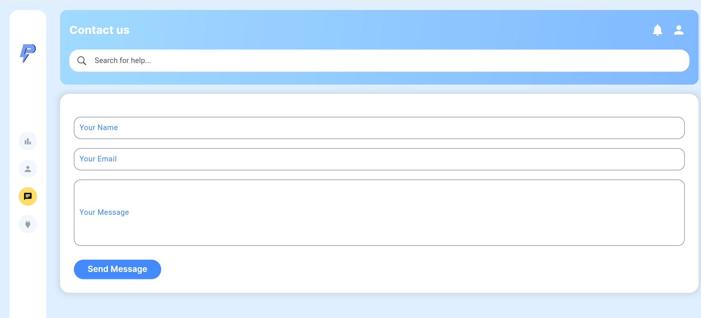

# SafyPower WebApp

**Réalisé par : Nada Mankai**  
**Contact :** [nadamainkai@gmail.com](mailto:nadamainkai@gmail.com)

---

## Description du Projet
Ce projet vise à améliorer la WebApp SafyPower en optimisant les performances, en éliminant les redondances de code, et en ajoutant de nouvelles fonctionnalités. Ces améliorations visent à enrichir l’expérience utilisateur, simplifier la maintenance et répondre aux besoins des entreprises clientes.

**Lien Rapport : https://docs.google.com/document/d/1cfT8WF36B10lJl4SIEVyERJSqlJOAndpIkKVACFB8Mw/edit?usp=sharing**
**demo : [https://docs.google.com/document/d/1cfT8WF36B10lJl4SIEVyERJSqlJOAndpIkKVACFB8Mw/edit?usp=sharing](https://drive.google.com/file/d/1McgI1xWxNAzJF-kBzqvq06pA2_I9_OlR/view?usp=sharing)**

---

## Travail Réalisé

### 1. Refactoring et Optimisation du Code
- **Suppression du Code Redondant :**
    - Fusion de layouts répétitifs (par exemple : `StatistiqueLayout`, `ProfileLayout`, `ContactLayout`) en un seul composant central : `AppLayout`.
    - Optimisation du composant `TopAppBar` pour afficher dynamiquement le titre des pages.

- **Réorganisation et Externalisation :**
    - Réorganisation de la structure du projet pour améliorer la lisibilité.
    - Externalisation des données statiques hors du code source.

- **Amélioration des Performances :**
    - Suppression des fichiers inutiles ou obsolètes.
    - Optimisations pour réduire le temps de chargement de l'application.

---

### 2. Fonctionnalités Ajoutées

#### Tableau de Bord Avancé
- **Suivi des Capteurs de Sécurité :**
    - **Détecteurs de fumée :** Affichage en temps réel de l’état (actif/inactif).
    - **Alarme incendie :** Alertes visuelles en cas d’activation.
- **Surveillance des Capteurs de Température :**
    - Indicateurs en temps réel pour surveiller les niveaux de température.
- **Statistiques en Temps Réel :**
    - Taux d’utilisation des casiers (en pourcentage).
    - Temps moyen d’utilisation des casiers.
      
      

#### Bouton ON/OFF Global
- **Fonctionnalité :** Permet d’allumer/éteindre toutes les prises d’une station depuis l’application.
- **Modal de Confirmation :** Empêche les actions accidentelles et améliore l'expérience utilisateur.
- **Impact Graphique :**
    - Mise à jour automatique des taux de disponibilité et d’utilisation dans les graphiques.
    - Synchronisation immédiate des changements via un `StateProvider`.
      
---

### 3. Révision de l’Onglet Utilisateur
- **Suppression des Sections Inutiles :**
    - Informations sur la carte bancaire, feedbacks, facturation.
- **Optimisation et Simplification :**
    - Mise en avant des informations essentielles (nom, identifiant utilisateur, rôle) sous forme de cartes.
    - Utilisation de widgets réutilisables pour une maintenance simplifiée.
- **Nouvelle Fonctionnalité :**
    - Modification des données personnelles directement dans l’application.
      
      
---

### 4. Refonte de la Section "Contact Us"
- Ajout d’un **modal de confirmation** après l’envoi d’un commentaire.
- Interface plus intuitive et interactive pour une meilleure expérience utilisateur.

---

## Propositions d’Améliorations

### 1. Suivi des Énergies Consommées par Prise
- **Graphiques Interactifs :** Affichage de la consommation énergétique par prise sur une période donnée.
- **Bénéfices :** Optimisation énergétique et planification de la maintenance.

### 2. Analyse et Prédiction
- **Prédiction de la Demande :** Intégration de machine learning pour anticiper les pics d'utilisation.
- **Détection d’Anomalies :** Identification automatique des comportements inhabituels.

### 3. Notifications Intelligentes
- **Alertes en Temps Réel :** Signaler les anomalies des capteurs ou une baisse critique de disponibilité.

### 4. Historique et Export des Données
- **Fonctionnalité d’Exportation :** Rapports détaillés en formats PDF ou Excel.

### 5. Optimisation du Tableau de Bord
- **Personnalisation des Widgets :** Réorganisation des graphiques selon les préférences des utilisateurs.

### 6. Gestion Financière et Reporting
- **Suivi des Coûts en Temps Réel :** Estimation et facturation automatique basées sur la consommation.

### 7. Optimisation Énergétique
- **Mode Économie d’Énergie :** Désactivation automatique des prises pendant les heures creuses.

### 8. Personnalisation Utilisateur
- **Préférences :** Langue, notifications, et affichage des données selon les besoins individuels.

### 9. Surveillance et Sécurité
- **Vidéo en Temps Réel :** Intégration à des caméras de surveillance.
- **Journal des Activités :** Suivi des actions avec horodatage.

---

## Conclusion
Les optimisations et fonctionnalités ajoutées renforcent la performance et l’expérience utilisateur de SafyPower. Les propositions d’amélioration futures visent à rendre l’application encore plus robuste et personnalisée pour les besoins des entreprises clientes.

---

## Contact
Nada Mankai  
? [nadamainkai@gmail.com](mailto:nadamainkai@gmail.com)  
